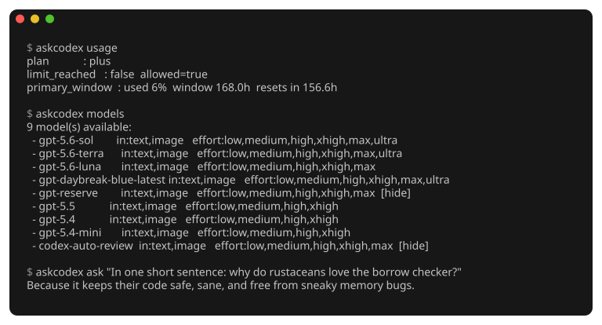
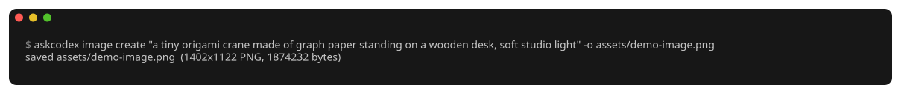

# askcodex

[](https://github.com/JairoTorregrosa/askcodex/actions/workflows/ci.yml)

Ask OpenAI's models from your terminal. One-shot text and images, zero
configuration.

```sh
askcodex ask "explain this stack trace" --model gpt-5.5
askcodex image create "a tiny origami crane" -o crane.png
askcodex usage
```

askcodex talks to the models your ChatGPT Plus/Pro plan already includes,
authenticating with the credentials the Codex CLI stores when you run
`codex login` — so there is no key to create and nothing to configure. It
is built to be driven by coding agents as much as by humans: every command
has a `--json` mode, and the repo ships an agent skill.



## Install

```sh
codex login    # once, with the Codex CLI, if you haven't already
git clone https://github.com/JairoTorregrosa/askcodex
cd askcodex
./install.sh
```

`install.sh` needs Rust 1.88+, installs to `~/.local/bin/askcodex`, uses no
sudo, and never writes to `~/.codex`. Prefer a prebuilt binary? Grab one
from the [releases](https://github.com/JairoTorregrosa/askcodex/releases),
check it against `SHA256SUMS`, and drop it in `~/.local/bin`.

## Ask a model

```sh
askcodex ask "write a commit message for a fix to the retry logic"
askcodex ask - --model gpt-5.5 --effort high < notes.md
askcodex models        # every slug you can pass to --model
```

Answers stream to stdout as they arrive. `-` reads the prompt from stdin.

## Make and edit images

```sh
askcodex image create "a tiny origami crane made of graph paper" -o crane.png
askcodex image edit "same crane, night scene, desk lamp" -i crane.png -o night.png
```




Each call returns exactly one opaque PNG at a size the backend picks.
There are no size, quality, transparency, format, or batch flags because
the backend ignores those parameters — askcodex only offers controls it can
actually honor. `edit` takes up to 5 reference images, PNG only.

## Check your account

```sh
askcodex usage                       # quota used per window, time to reset
askcodex whoami                      # plan and identity
askcodex auth status --no-refresh    # token expiry; never prints a token
```

## Script it

Every command takes `--json` (exactly one JSON document on stdout) and
`--no-refresh` (guarantees `auth.json` is never touched). For endpoints
askcodex doesn't model:

```sh
askcodex raw GET /codex/usage --json
askcodex raw POST /codex/responses --body - --stream < request.json
```

`raw` only ever sends your credentials to the backend's own origin; any
other host is refused before a request exists.

## Safety

- **Failures are loud.** Missing auth, failed refresh, unexpected response:
  message on stderr, non-zero exit. No placeholder output, no silent
  fallback.
- **Tokens cannot be printed.** Token values live in a newtype that redacts
  `Debug` and `Display`; no command, log line, or error can contain one.
- **`auth.json` is safe.** Rewritten only atomically (0600 temp file,
  fsync, backup, rename), and keys askcodex doesn't understand round-trip
  untouched. `askcodex auth refresh` rotates tokens on demand; everything else
  can be run with `--no-refresh`.

askcodex ships an agent skill (`install.sh` wires it into
`~/.claude/skills/askcodex` and `~/.agents/skills/askcodex`) so coding agents can
drive it too — see
[AGENTS.md](AGENTS.md). [DESIGN.md](DESIGN.md) has the full rule set and
[docs/PROTOCOL.md](docs/PROTOCOL.md) the wire protocol, with every fact
tagged by how it was verified against the real backend.

## Development

```sh
cargo test
cargo clippy --all-targets -- -D warnings
cargo fmt --check
```

The suite is offline: HTTP is mocked and every test points `CODEX_HOME`
at a temp directory, so nothing reads your real `~/.codex`. Live checks
are opt-in via `ASKCODEX_LIVE=1` ([docs/TESTING.md](docs/TESTING.md)).
Contributing? See [GOVERNANCE.md](GOVERNANCE.md).

## License

MIT or Apache-2.0, at your option.
